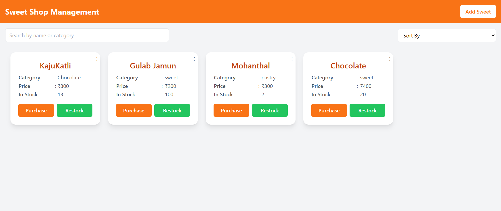
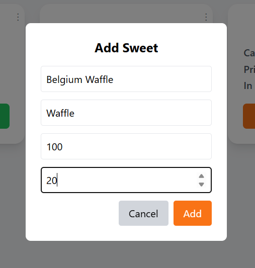
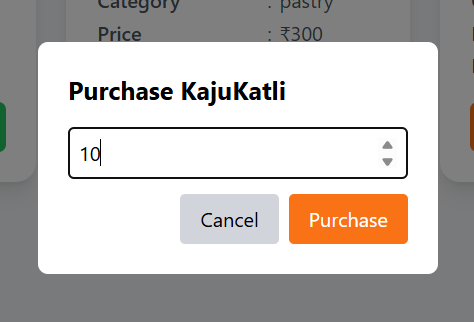
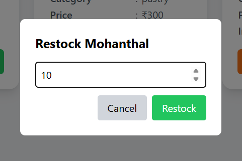
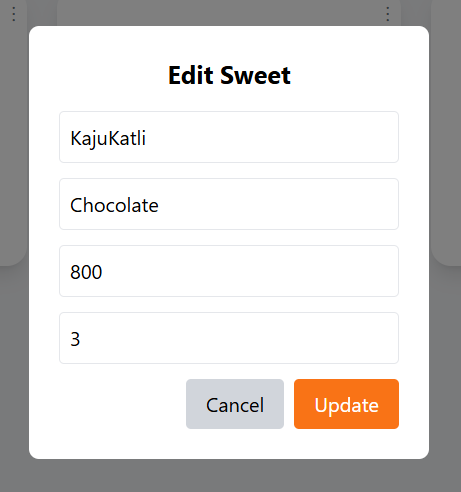
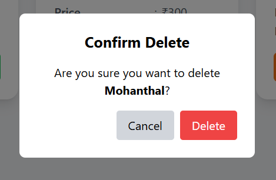

Sweet Shop Management System

    A simple Sweet Shop Management System , featuring CRUD operations, purchase, restock, search, sort, and responsive frontend.

Tech Stack

Backend:

    Node.js with Express.js
    MongoDB with Mongoose
    Jest & Supertest for backend testing
    CORS

Frontend:

    ReactJS
    Axios
    TailwindCSS for styling
    React Toastify for notifications

Screenshots

